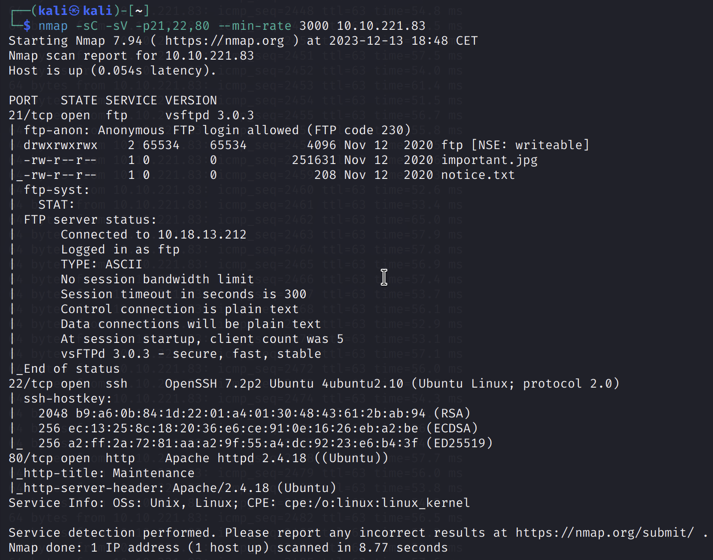
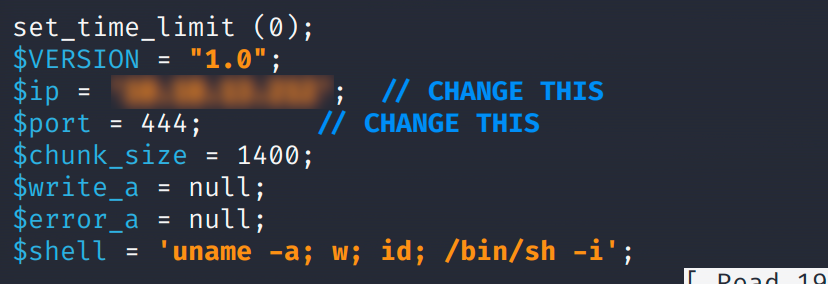
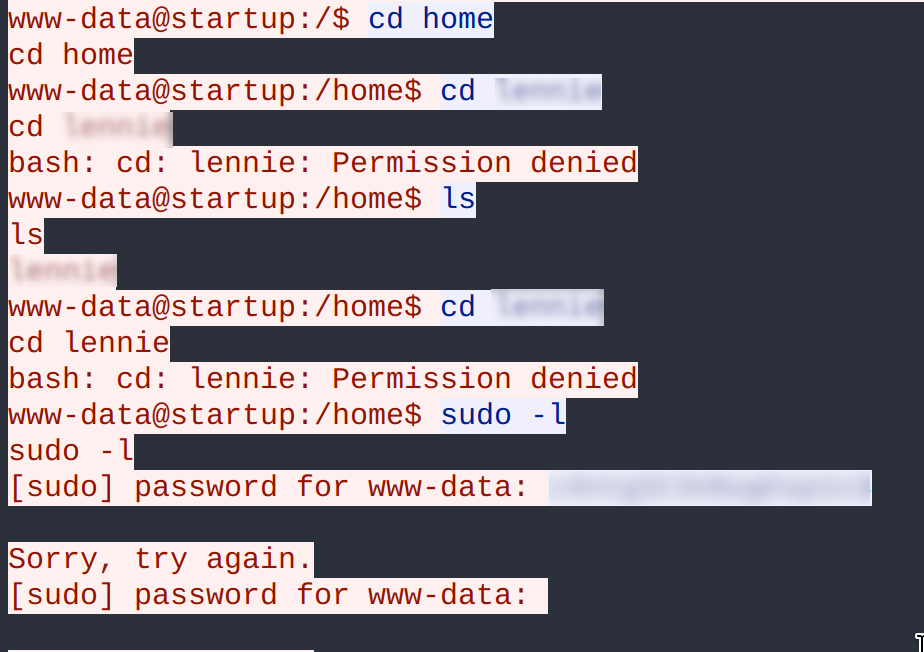
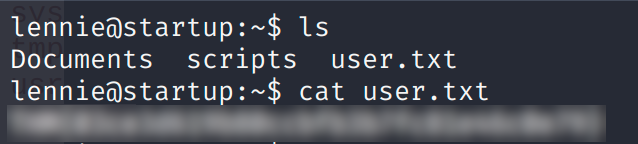
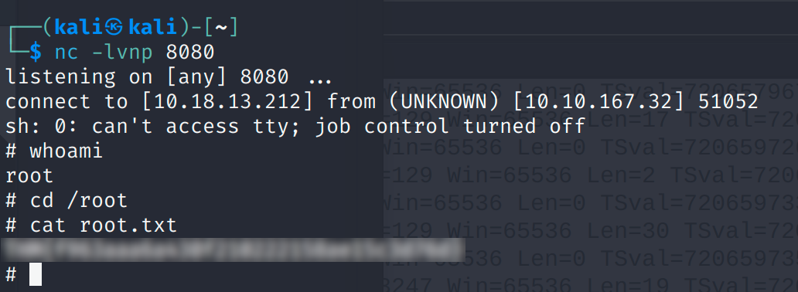

# User.txt

Vamos a realizar un escaneo de puertos con `nmap -p- -v <ip_maquina>`  y vemos que solo tenemos abierto el puerto 21, 22, 80.

  

> Tenemos los servicios ftp , ssh y una pagina web habilitadas.

  <table>
    <tr>
      <td style="vertical-align:top; width:50%;">
        Vamos a realizar una conexión ftp mediante el user Anonymous, ya que este permite conexiones anónimas:
        

          
        

      </td>
      <td style="vertical-align:top;  width:50%">
        Estamos dentro y vamos a realizar un listado de archivos para ver que contiene el directorio en el que estamos:
        

          
        

        Encontramos un directorio y dos archivos (Nada relevante), los cuales podemos descargar mediante el comando <code>get nombre_archivo</code> y abrilos en nuestra máquina.
      </td>
    </tr>
  </table>

Como no hemos encontrado nada en el servidor vamos a acceder a la pagina web → `http://<ip_maquina>`

  

Resultado al acceder a la pagina web de la maquina, nada interesante a simple vista, pero mediante **fuzzing** podemos enumerar los directorios de la misma, yo haré uso de **gobuster** → `gobuster dir --url ip_maquina_victima -w ruta_wordlist`:

  

Como bien sabemos tenemos activo un servicio *FTP* (al que accedimos antes), pero esta vez vamos a usarlo para subir archivos, estos archivos se encuentran en el directorio `/files`. Este archivo que vamos a subir será una reverse shell, la cual al ejecutarla desde el servidor, este se conectará a nuestra máquina y tendremos acceso a ella:
En Github podemos buscar algún script el cual realice una reverse shell → [pentestmonkey/php-reverse-shell](https://github.com/pentestmonkey/php-reverse-shell)

  <table>
    <tr>
      <td style="vertical-align:top; width:50%">
      Dentro del script debemos de modificar los campos <strong>$ip</strong> y <strong>$port</strong> introduciendo la ip de nuestra máquina y el puerto habilitado para la escucha con netcat, respectivamente.
      

        
      

      </td>
      <td style="vertical-align:top; width:50%">
        Mediante <strong>netcat</strong> habilitamos el puerto de escucha para la reverse shell, este caso el puerto 444:
        

          
        

      </td>
    </tr>
  </table>

Si nos volvemos a conectar al servidor *FTP* y realizamos un `put script_reverse_shell.php` veremos que se realiza la conexión y estamos dentro del servidor (como se puede ver en la figura anterior).

Vemos que somos el usuario **www-data** al hacer uso del comando `ls -la`, y vamos a proceder a la búsqueda de las flags. Para ello, lo más intuitivo es realizar una búsqueda de los ficheros que hay en el servidor -> `find -type f -name nombre_fichero.txt 2>/dev/null`, donde `-type` es el tipo del archivo (fichero), `-name` nombre del fichero a buscar y `2>/dev/null` devuelve los errores al null. Como resultado no encontramos nada, por lo que hay que seguir buscando.

  <table>
    <tr>
      <td style="vertical-align:top; width:50%">
        Si realizamos un listado de archivos y directorios podemos ver que hay un directorio llamado `/incidents` al cual podemos acceder. Si accedemos a él y volvemos a listar, encontramos un par de archivos:
        

          
        

      </td>
      <td style="vertical-align:top; width:50%">
       En este directorio vemos que hay un archivo con extensión '*.pcap*' (una captura de tráfico de red), y lo vamos a copiar en el directorio <code>/var/www/html/files/ftp</code> para poder descargarlo en nuestra máquina para analizarlo posteriormente:
         

          
        
 
      </td>
    </tr>
  </table>

Por ejemplo, desde la página web podemos ver si se ha copiado o no el archivo:

  

Ahora podemos descargarlo ya sea pinchando en él o haciendo un wget → `wget ip_maquina:/files/ftp/suspicious.pcapng`.
Esta captura del tráfico de red la podemos analizar mediante la herramienta **Wireshark**:

  <table>
    <tr>
      <td style="vertical-align:top; width:50%">
        

        Hemos accedido a la captura del tráfico de red:
          
        

      </td>
      <td style="vertical-align:top; width:50%">
         

           Seguimos el flujo de tráfico:
          
        
 
      </td>
    </tr>
  </table>

Vamos a seguir el flujo de tráfico TCP para poder encontrar información:

  

Hemos encontrado información acerca de un directorio llamado */home/lennie*, por tanto, este directorio pertenece a un usuario, además tenemos su contraseña por lo que no tendríamos que realizar ningún ataque de fuerza bruta para obtenerla.

  <table>
    <tr>
      <td style="vertical-align:top; width:50%">
      Si volvemos al escaneo de puertos realizado en primera instancia vemos que hay un servicion *SSH* corriendo por el puerto 22, asi que vamos a iniciar sesión mediante esas credenciales para acceder al servidor:
        

          
        

      </td>
      <td style="width:50%">
      Estamos dentro, vamos a tirar un `ls` para poder ver los archivos y directorios que hay en este.  
      Hemos encontrado un fichero llamado <em>user.txt</em>, por lo que si le hacemos un <code>cat user.txt</code>, tendremos la flag:
      

          
        

      </td>
    </tr>
  </table>

# Root.txt

Para poder obtener la flag ‘Root.txt’ tenemos que buscar una manera de poder escalar privilegios, ya que solo podremos acceder a ella mediante dichos privilegios.
Podemos escalar privilegios de muchas maneras, por lo que primero de todo vamos a comprobar que comandos puede ejecutar como root el usuario *lennie*:

  

Como vemos, no podemos ejecutar ningún comando como root, por lo que vamos a buscar otra manera:

En la búsqueda de la *user.txt* vimos que había un directorio llamado `/scripts`, vamos acceder a él para ver que encontramos:

  

En el directorio hemos encontrado un archivo *planner.sh*, que es un script bash que contiene `cat planner.sh`:

  

Vemos que llama a un archivo *print.sh* el cual si puede ejecutarlo, por tanto, podemos colar una reverse shell en el fichero para que se pueda ejecutar. Si hacemos un `cat /etc/crontabs` podemos ver que el archivo *planner.sh* y *startup_list.txt* pertenecen al root, por lo que estas se ejecutarán como root.

Si accedemos a la web [Revshells](https://www.revshells.com/) podemos crear una reverse shell que luego introduciremos en dicho fichero:

  <table>
    <tr>
      <td style="vertical-align:top; width:50%">
      1. Modificamos el archivo <em>/etc/print.sh</em> introduciendo la reverse shell
        

          
        

      Si esperamos un poco vemos que la conexión se realiza con éxito. Podemos ver que somos el usuario root por lo que ya podremos acceder a la flag la cual se encuentra en <code>/root/root.txt</code>. (como podemos ver en la imagen de la derecha).
      </td>
      <td style="vertical-align:top; width:50%">
      2. Habilitamos un puerto de escucha para que el servidor se conecte a nuestra máquina:
      

          
        

      </td>
    </tr>
  </table>

---