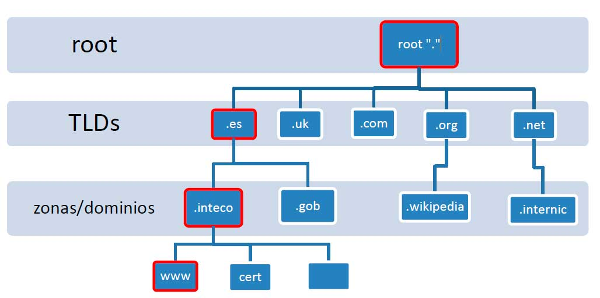

# ¿Qué es DNS?

El DNS ‘<em>Domain Name System</em>’ nos proporciona una forma de comunicarnos con dispositivos por internet sin tener que recordar todas las [direcciones IPs](https://joseeelv.github.io//blog/Nw).

Para ello, el <em>DNS</em> nos ayuda de la forma que a cada dirección IP le da un dominio ó conjunto de dominios únicos para poder acceder a él, sin tener que recordar la dirección del mismo.

  

Vemos como el dominio ‘[Google.com](http://google.com)‘ está asociado a una dirección IP ‘216.58.217.206’, donde el servidor DNS traduce dicho dominio a su ip correspondiente.

# Jerarquía de dominios

Los dominios al igual que los sistema de ficheros de los sistemas operativos contienen una jerarquía. 

  <table>
    <tr>
      <td style="vertical-align:top;">
        

          
        

        <h2>Dominios de segundo nivel</h2>
        Preceden al TDL, es el nombre que recibe la dirección IP al realizar la conversión por el servidor DNS. 
        Está limitado a 63 caracteres (a-z) y 0-9, además puede hacer uso de guiones + el TDL.
      </td>
      <td style="vertical-align:top; width:50%;">
        <h2>TDL (Top-Level Domain)</h2>
        El TDL es la parte más a la derecha de un dominio y va precedido por un punto , en el caso de google.com, el TLD sería ‘<em>.com</em>’.  
        Encontramos dos tipos de TLDs, los gTDL ‘genéricos’ y los ccTDL ‘país’.
        <ul>
          <li><em><strong>gTDL</em></strong>> → Está destinado a informar del propósito del dominio, por ejemplo, ‘<strong>>.com</strong>>’ está destinado a lo comercial,  ‘<strong>>.org</strong>>‘ destinado a una organización, etc.</li>
          <li><em><strong>ccTDL</em></strong>> → Se utiliza con fines geográficos, por tanto, si termina en ‘<strong>>.es</strong>>’ para sitios con sede en España.</li>
        </ul>
         <h2>Subdominio</h2>
        Se encuentra a la izquierda del <em>dominio de segundo nivel</em>, se hace uso de un punto para separarlos.  
        Por ejemplo, el dominio <em>support.google.com</em>, la parte <em>support</em> es el subdominio. 
        Mismo limite que los dominios de segundo nivel, pero no puede ni empezar ni terminar con guiones ni usar el guion bajo ( <em>_</em> ).
      </td>
    </tr>
  </table>

<h1>Tipos de registros</h1>

> El DNS puede ser usado para sitios webs y para otros fines, por tanto, existen varios tipos de registros DNS.

  <table>
    <tr>
     <td style="vertical-align:top; width:25%">
      <h2>Registro A</h2>
      Estos registros son resueltos en <strong>direcciones IPv4</strong>.
      <h2>Registro AAAA</h2>
      Estos registros son resueltos en <strong>direcciones IPv6</strong>.
      </td>
      <td style="vertical-align:top;  width:25%">
        <h2>Registro CNAME</h2>
        Estos registros se resuelven en otro nombre de dominio y desde este se realiza otra solicitud DNS para resolver la dirección IP.
      </td>
      <td style="vertical-align:top;  width:25%">
        <h2>Registro MX</h2>
        Estos registros se resuelven en la dirección de los servidores de correo electrónico para el dominio que estamos consultado. 
        Vienen con una ‘<em>flag</em>’ de prioridad.
      </td>
      <td style="vertical-align:top;  width:25%">
        <h2>Registro TXT</h2>
        En él se puede almacenar datos basados en texto y tienen múltiples usos, como enumerar servidores que pueden enviar correos electrónicos (controlando así los correos falsos y spam).
      </td>
    </tr>
  </table>

# Solicitud DNS

> Vamos a ver paso a paso que sucede a realizarse una solicitud DNS.
<ol>
  <li>Cuando solicitamos el nombre de un dominio, nuestra computadora primero comprueba en su caché si se ha accedido a la dirección previamente. Si no es así, se realizará una petición un servidor DNS recursivo.</li>
  <li>El servidor DNS recursivo es proporcionado por nuestro ISP. Este servidor contiene una caché que han sido buscados recientemente. Si el resultado se encuentra en ahí, se vuelve a mandar a nuestra máquina, si no se encuentra en la caché local, se busca la dirección en los servidores DNS root de internet.</li>
  <li>Los servidores DNS roots actúan como la columna vertebral de los DNS en internet. Su trabajo consiste en redireccionarnos a los <strong>servidores de dominios Top-Level</strong></li>
  <li>El servidor TDL contiene registros para buscar el servidor DNS autorizado para responder a la petición DNS.</li>
  <li>El servidor DNS autorizado es el responsable de almacenar los registros DNS para un dominio en concreto y donde se realizará cualquier actualización a los registros DNS del nombre de dominio.</li>
Dependiendo del tipo de registro, el registro DNS será enviado de nuevo al servidor DNS recursivo, realizando una copia en la caché local para futuras peticiones.
</ol>

---