First, we use `ping` to check if we have a connection to the machine and identify the OS.

  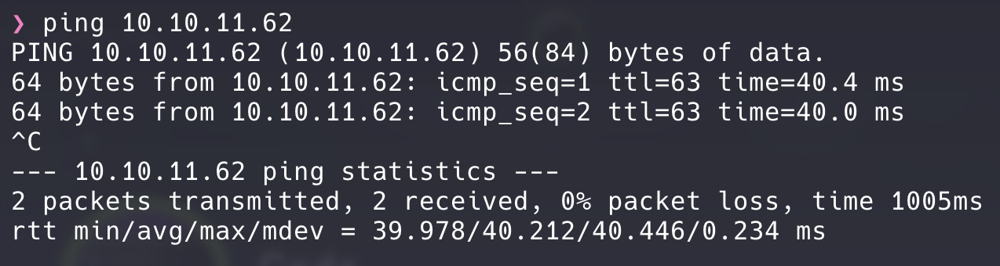

Let's use _Nmap_ to find out the machine's running services & open ports:

**Port Scanning:**

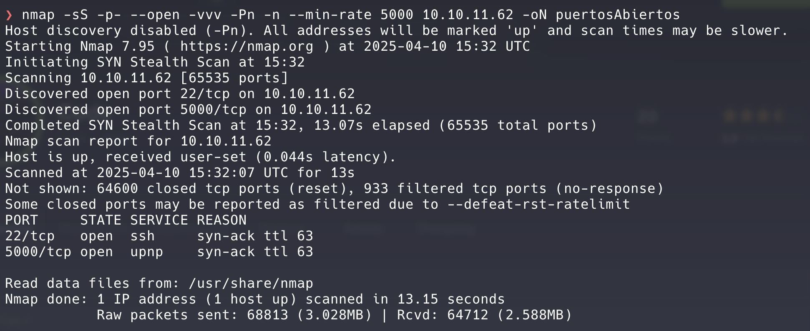

**Service Scanning:**

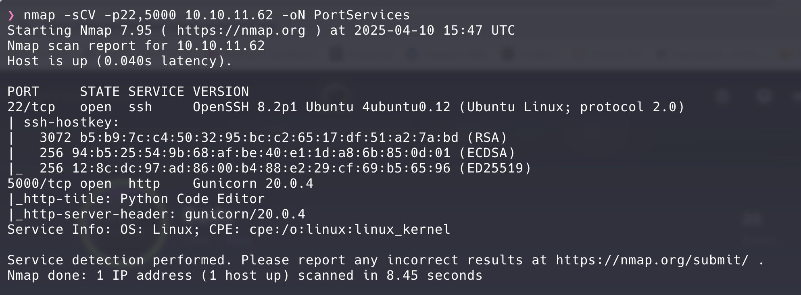

Reveals services running on open ports: SSH (22) and HTTP (5000).

  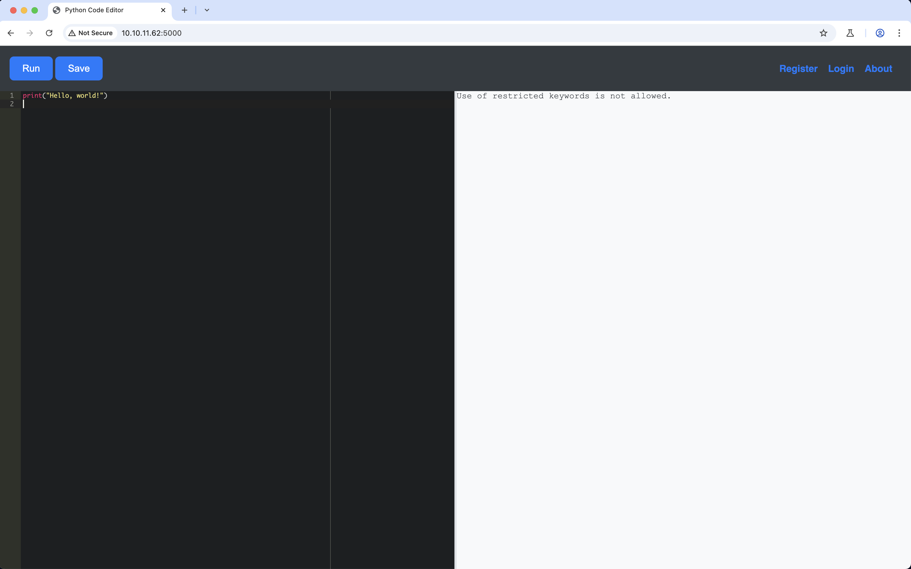

This is the webpage.

As we can see, this web is a Python code interpreter, so we can try executing code using the `os` library:

  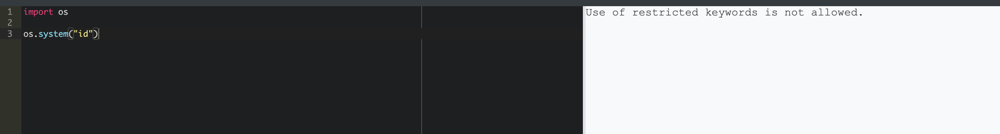

Certain keywords are blocked, so we need to find an alternative.

Let's perform fuzzing to discover more:

 

    

      Bash
      <button class="copy-button" data-code="bash">Copy</button>
    

    <pre><code class="language-bash">wfuzz -c --hc 404 --hl=99 -w [wordlist] http://10.10.11.62:5000/FUZZ</code></pre>
  

Results:

  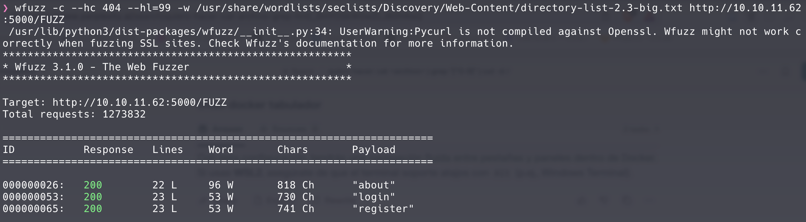

Nothing relevant was found.

The key lies in the Python code interpreter. 

We can use [Python exceptions](https://docs.python.org/3/library/exceptions.html){:target="_blank"}  to gather information. By executing `raise Exception(globals())`, we find a database in the output:

 

    

      Bash
      <button class="copy-button" data-code="bash">Copy</button>
    

    <pre><code class="language-bash" ><SQLAlchemy sqlite:////home/app-production/app/instance/database.db></code></pre>
  

Now, we can extract information from the database by running the following script in the Python interpreter to retrieve usernames and passwords:

 

    

      Bash
      <button class="copy-button" data-code="bash">Copy</button>
    

    <pre><code class="language-bash" >users = db.session.query(User).all()
for user in users:
    print(user.username, user.password)</code></pre>
  

The passwords are hashed, so we use `hash-identifier` to identify the hash type:

  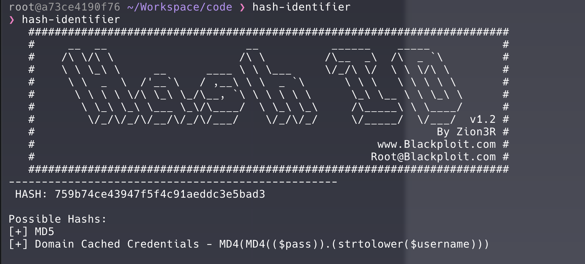

They are **MD5**, which is vulnerable to cracking. Let's crack them using `hashcat`:

 

    

      Bash
      <button class="copy-button" data-code="bash">Copy</button>
    

    <pre><code class="language-bash">hashcat -a 0 -m 0 [hash] [wordlist]</code></pre>
  

With the obtained credentials, we attempt to log in via SSH, and indeed, we can log in as martin:

  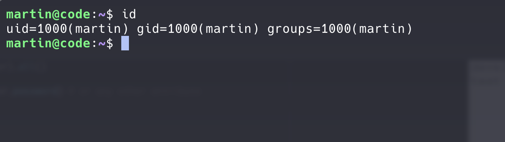

Now, let's find a way to escalate privileges.

First, check what the user can do with `sudo -l`:

  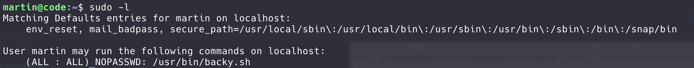

We can execute a script `backup.sh` as sudo. When executed, it requires a `task.json` file:

  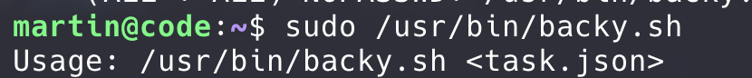

Content of `task.json`:

  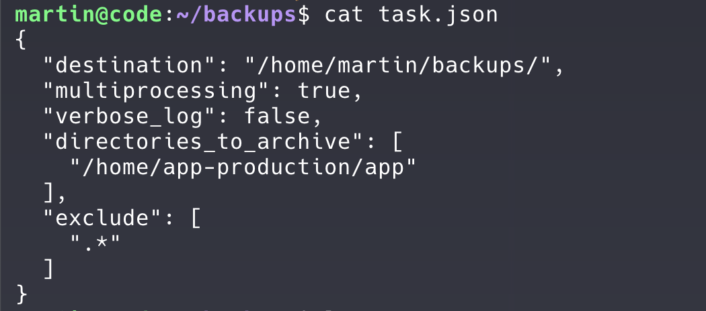

Our first goal is to find the `user.txt` flag. Navigating through directories, we notice that we don't have access to `/home/app-production/` and can't find the flag. So, we modify

  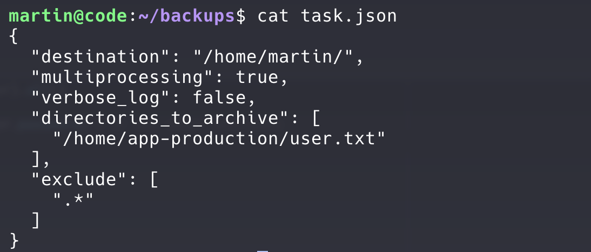

Incluimos la flag en el .json para ver si hay suerte y la obtenemos a la hora de hacer el backup.

  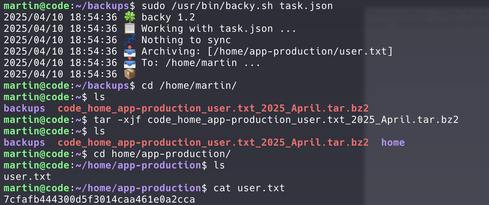

Tenemos la flag del user, ahora vamos a por la del root.

La flag del root se encuentra en el directorio **/root**, por tanto, vamos a probar a introducir dicho directorio en el task.json:

  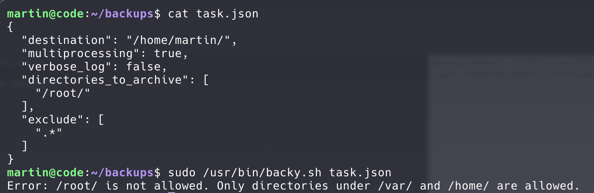

Vaya.. Nos dice que solamente son válidos los directorios **/home** y **/var**. Una manera de evadirlo sería mediante path traversal donde indicamos uno de los dos directorios permitidos y luego le insertamos el directorio del root. Vamos a intentarlo:

  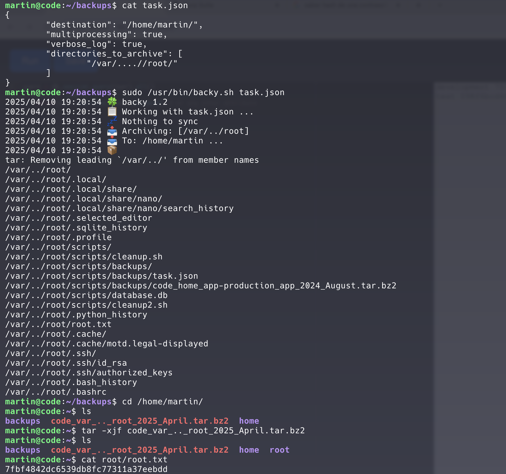

Ha funcionado, y hemos obtenido la flag del root.

---

  

