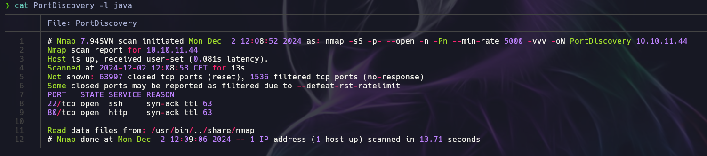
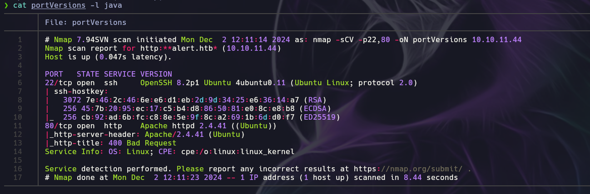
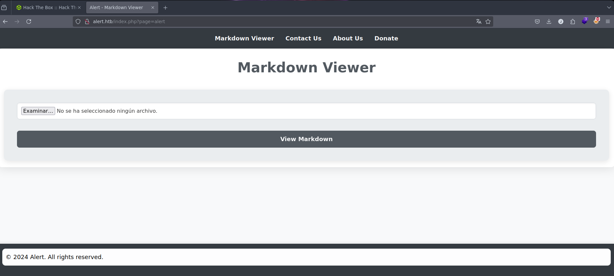
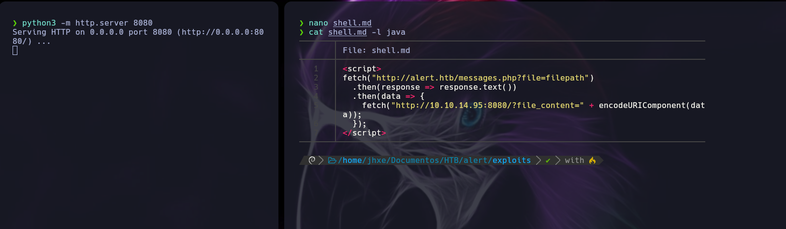

<table>
  <tr>
    <td>
      To begin, I will perform a port scan to identify which ports are open on the target system:
      <div style="text-align:center;">
        <div class="code-container">
          <div class="code-header">
            Bash
            <button class="copy-button" data-code="bash">Copy</button>
          </div>
          <pre><code class="language-bash">sudo nmap -p- -open -sS -n -Pn -vvv --min-rate 5000 &lt;target_IP&gt; -oN PortDiscovery</code></pre>
        </div>
        <div style="text-align: center;">
          
        </div>
      </div>
    </td>
    <td>
      Secondly, I will perform an exhaustive scan to identify the versions and services running on these ports:
      <div style="text-align:center;">
        <div class="code-container">
          <div class="code-header">
            Bash
            <button class="copy-button" data-code="bash">Copy</button>
          </div>
          <pre><code class="language-bash">sudo nmap -sCV &lt;target_IP&gt; -oN portVersions</code></pre>
        </div>
        <div style="text-align: center;">
          
        </div>
      </div>
    </td>
  </tr>
</table>

As you can see above, I decided to save the evidences in order not to lose them.

Also, we can see that virtual hosting is being performed at <em>http://alert.htb</em>, so we need to include this domain in our <code>/etc/hosts</code> file.

Great! After both scans, we have gathered several piece of information about the open ports, such as port 22 (<em>SSH</em>) and port 80 (<em>HTTP</em>) services.

At this moment, we don't have credentials to perform a connection via <em>SSH</em>, so our next step will be check the website running on port 80.

<div style="text-align: center;">
  
  <p>Website running on port 80.</p>
</div>

We can try to fuzz the website, but we will see that it does not contain any hidden directories.

But, there is no problem. On this web application we can see that it is a '<em>Markdown Viewer</em>' and we can upload Markdown '.md' files.

<div style="text-align: center;">
  
</div>
<div style="text-align: center;">
  
</div>
<div style="text-align: center;">
  
</div>
<div style="text-align: center;">
  
</div>
<div style="text-align: center;">
  
</div>
<div style="text-align: center;">
  
</div>
<div style="text-align: center;">
  
</div>
<div style="text-align: center;">
  
</div>
<div style="text-align: center;">
  
</div>
<div style="text-align: center;">
  
</div>
<div style="text-align: center;">
  
</div>
<div style="text-align: center;">
  
</div>
<div style="text-align: center;">
  
</div>
<div style="text-align: center;">
  
</div>
<div style="text-align: center;">
  
</div>
<div style="text-align: center;">
  
</div>
<div style="text-align: center;">
  
</div>
<div style="text-align: center;">
  
</div>
<div style="text-align: center;">
  
</div>
<div style="text-align: center;">
  
</div>

Escaneo de los puertos abiertos de la máquina vícitma


Para acceder a la web tenemos que modificar el `/etc/hosts`.


Subimos el archivo indicando la ruta a leer, y luego guardamos el enlace del botón “share markdown”, el cual lo pondremos en la caja de comentarios de ‘*Contact Us*’ (ya que es vulnerable a XSS):


Contenido del `/etc/passwd` url-encoded:


Hemos encontrado los usuarios *david* y *albert*, vamos a intentar realizar una ataque de fuerza bruta al protocolo ssh.

Pero no hay respuesta de las contraseñas, por lo que tendremos que seguir buscando información mediante el XSS con RCE:

Como estamos en un servidor *Apache* primero nos interesa saber el contenido del directorio `/etc/apache2/sites-enabled/000-default.conf`:

Destacamos lo siguiente:


Donde vemos que el directorio `/var/www/statistics.alert.htb/.htpasswd` contiene credenciales de autenticación del usuario, por lo que vamos a echarle un ojo, configurando el .md con dicha ruta:


Vamos a ver que nos devuelve el servidor:


Vemos que tenemos al usuario *albert* con el hash de su contraseña, por lo que vamos a hacer uso de Hashcat para conseguir la password:

```bash
hashcat -a 0 -m 1600 hash.txt /usr/share/wordlists/rockyou.txt
```

Donde, `-a 0` es el modo de ataque por diccionario y `-m 1600` es el hash correspondiente a Apache md5.

Con estas credenciales, podemos acceder via ssh al servidor:


Ahora escribimos → `ssh albert@IP_Victima` y ponemos la contraseña crackeada, y estamos dentro:


Buscamos la user.txt y la mostramos por pantalla.


Ahora, nuestro objetivo es buscar un vector de escalada de privilegios:

Buscamos los binarios con bit SUID activados, pero no encontramos nada:


Vamos a hacer uso de `sudo -l`:


Tampoco podemos hacer uso de `sudo -l`, vamos a buscar si hay tareas programadas y nada.

Podemos buscar también si el root está realizando una escucha mediante el comando `netstat`:


Este es un puerto que no es accesible desde afuera, por lo que podemos hacer un port forwarding con **chisel** a nuestra máquina → https://github.com/jpillora/chisel/releases/tag/v1.10.1


Nos mandamos el chisel a la máquina victima y ejecutamos:

En nuestra máquina (modo servidor)


En la máquina victima (modo cliente)


Si ahora accedemos a la web o hacemos un **curl** a `localhost:8080` tenemos lo siguiente:


Esta web está contenida en el directorio `/opt/website-monitor`:


Buscamos un directorio donde podamos escribir, por ejemplo en `/config`:


Nos ponemos en escucha desde nuestra máquina a dicho puerto y ahora desde el navegador o haciendo uso de `curl` accedemos al recurso:

```bash
curl -s localhost:8080/config/shell.php
```


Como resultado tenemos:


---

[Owned Alert from Hack The Box!](https://www.hackthebox.com/achievement/machine/1157775/636)